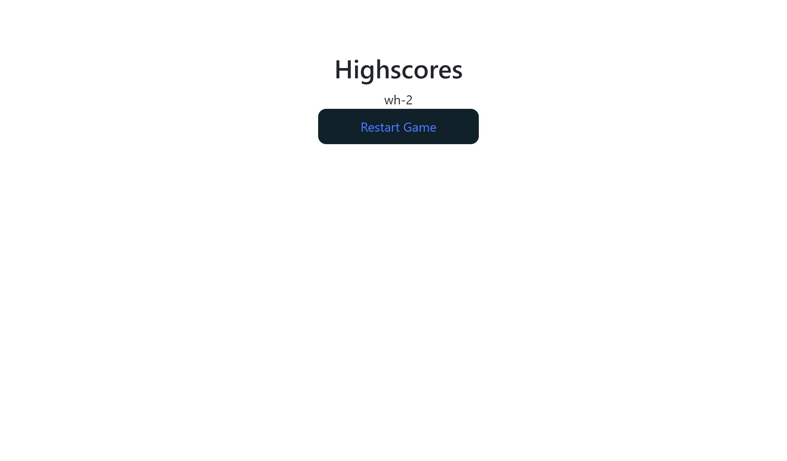

# Code Quiz

Project link: [https://github.com/lillianhuynh/Code-Quiz]

Github-page: [https://lillianhuynh.github.io/Code-Quiz/]

## Table of Contents

* [About the Project](#about-the-project)
  * [Built With](#built-with)
* [Getting Started](#getting-started)
  * [Installation](#installation)
* [Usage](#usage)
* [Roadmap](#roadmap)
* [Contributing](#contributing)
* [License](#license)
* [Contact](#contact)

## About The Project


"Code Quiz" is a timed coding quiz with multiple-choice questions. You can also save your score and compare it with friends. Have fun!


### Built With

N/A

## Getting Started

To get a local copy up and running follow these simple steps.

### Installation

1. Clone the repo
```sh
git clone https://github.com/lillianhuynh/Code-Quiz
```

## Usage

You can start the game by clicking "Start Quiz" button. You will then be introduced to 3 multiple choice questions. Every correct answer will increase your score by 1. If the timer ends or you have finished all the question, your scores will be displayed on the highscore screen. Keep in mind, you only have 30 seconds to answer all questions, and 5 seconds will get deducted if you answer it wrong.

| User Score    | End Game|
|------------|------------|
|  |  |


## Roadmap

See the [open issues](https://github.com/lillianhuynh/Code-Quiz/issues) for a list of proposed features (and known issues).

## Contributing

Contributions are what make the open source community such an amazing place to be learn, inspire, and create. Any contributions you make are **greatly appreciated**.

1. Fork the Project
2. Create your Feature Branch (`git checkout -b feature/AmazingFeature`)
3. Commit your Changes (`git commit -m 'Add some AmazingFeature'`)
4. Push to the Branch (`git push origin feature/AmazingFeature`)
5. Open a Pull Request

## License

N/A

## Contact

Lili Huynh- lillianhuynh312@gmail.com
Project link: [https://github.com/lillianhuynh/Code-Quiz]


